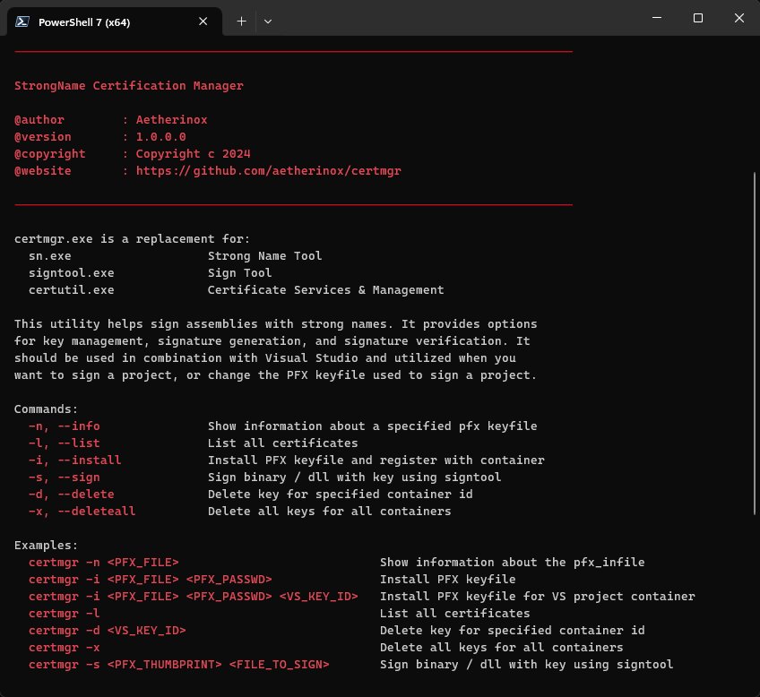

<p align="center"></p>
<h1 align="center"><b>Certificate Manager</b></h1>

<div align="center">

   

</div>

---

<br />

# About

`certmgr` is a utility which aims to replace `sn.exe` (the Strong Name Utility).

The primary use behind it is an error that people will often find themselves running across when attempting to sign their Visual Studio projects:


> [!WARNING]  
> Cannot import the following key file: your_keyfile.pfx. The key file may be password protected. 
> 
> To correct this, try to import the certificate again or manually install the certificate to the Strong Name CSP with the following key container name: 
`VS_KEY_ABCDEF1234567000`

<br />

The above error can occur either when you're attaching a new keypair to your project, or wanting to replace / update an existing keypair.

Typically to correct this, you would utilize `sn.exe` and execute the command:

```shell
sn -i <KeyFile> <ContainerName>
```

However, many users (and myself) have ran across the issue that this command does not rectify the issue.

`certmgr.exe` makes registering your certificate easier by executing

```shell
./certmgr.exe --install your_keyfile.pfx "CERT_PFX_PASSWORD" VS_KEY_XXXXXXXXXXXXXXXX
```

You should then be able to successfully build your project and sign it with your new key.

<br />

Full commands listed below.

<br />

---

<br />

# Dependencies
This console application has a few dependencies depending on your needs.

<br />

| Dependency | Description |
| --- | --- |
| `certutil` | <br />[Certutil](https://learn.microsoft.com/en-us/windows-server/administration/windows-commands/certutil) is required for CertMgr **Delete** and **List** functionality.<br /><br />Certutil should come with windows and is part of the Windows Certificate service. <br /><br />You should already have it with your operating system. <br /><br />|
| `signtool` | <br />The [Sign Tool](https://learn.microsoft.com/en-us/windows/win32/seccrypto/signtool) is required if using the CertMgr **Sign** functionality. <br /> <br /> Can be installed from the [Windows 10 SDK / Windows 11 SDK / Windows Kit](https://developer.microsoft.com/en-us/windows/downloads/windows-sdk/), or [Visual Studio](https://visualstudio.microsoft.com/downloads/). <br /> <br /> |

<br />

---

<br />

# Commands

The following information displays the command syntax for certmgr.exe

<br />

### Flags

| Flag | Description |
| --- | --- |
| `-n, --info` | Show information about a specified PFX keyfile |
| `-l, --list` |  List all certificates and containers |
| `-i, --install` |  Install PFX keyfile and register with container |
| `-s, --sign` |  Sign binary / dll with key using signtool |
| `-d, --delete` |  Delete keyfile for specified container id |
| `-x, --deleteall` |  Delete all keys for all containers |

<br />

### Syntax
| Command | Description |
| --- | --- |
| `certmgr -n <PFX_FILE>` | Show information about a specified PFX keyfile  |
| `certmgr -i <PFX_FILE> <PFX_PASSWD>` | Install PFX keyfile |
| `certmgr -i <PFX_FILE> <PFX_PASSWD> <CONTAINER_ID>` | Install PFX keyfile for Visual Studio project container |
| `certmgr -l` | List all certificates |
| `certmgr -d <CONTAINER_ID>` | Delete key for specified container id |
| `certmgr -x` | Delete all keys for all containers |
| `certmgr -s <PFX_THUMBPRINT> <FILE_TO_SIGN>` | Sign binary / dll with key using signtool |

<br />

---

<br />

# Previews

<p align="center"></p>